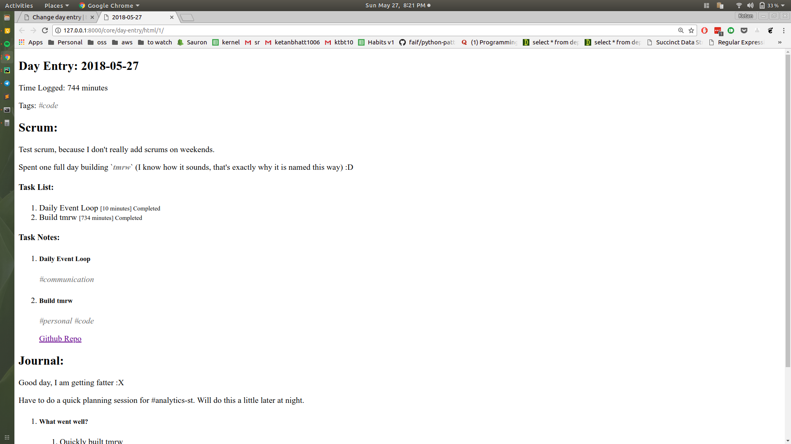

# tmrw

Short for `tomorrow`, tmrw marks me giving up all hope on the time tracking apps out there. There are some excellent applications like [Toggl](https://toggl.com/) or [Timely](https://timelyapp.com) but they are:
1. Either too expensive (everything above free is expensive)
2. or, do not have a native experience for Linux
3. or make me log time manually.

If I do have to log time manually, that too by going to a browser (or by starting a timer on an ugly interface), I figured I could do something on my own, and build more stuff that suits my workflow.

My workflow has the following components:
1. A to-do app
2. A note taking app
3. Time tracking
4. Analytics for retrospection later (where did I spend time?)
5. A journaling app so I can write down thoughts and learn from them over time

Since it would be a huge headache to do all of this on different apps, I was maintaining notes on Google Docs, a document for each day. This worked well, except that:
1. Can not draw graphs and analyse time spent since data is not structured (Maybe use Google Sheets? But then Google Sheets doesn't let me write notes freely)
2. Manually copy-pasting templates, adding headings etc myself for different list items.
3. No scope of future improvements, this workflow was maxed out to its potential. Maybe a few shortcuts here and there, but that was the limit.

So it made sense to build something on my own.

## My requirements
Roughly:
1. Be able to log time for activities, of course
2. Be able to create a list of stuff that I have to do in the day (like a to-do/scrum)
3. Be able to add notes corresponding to each list item
4. Be able to also journal thoughts
5. Log time, start/stop timer for each task with minimal friction --> I can just build bash commands to quickly do most of the frequently needed stuff.
6. Analyse data over time
7. I keep all my data, forever.

## Current Status
I have used the first version for 40+ days now. After making sure I am using it, have added a simple UI to it so that I don't have to scroll a lot for finding my scrum entries. Of course the old Django Admin is still active in use for fine grain control and fixing mistakes.

#### New UI

#### Admin views:

#### Basic HTML Render of the Day

